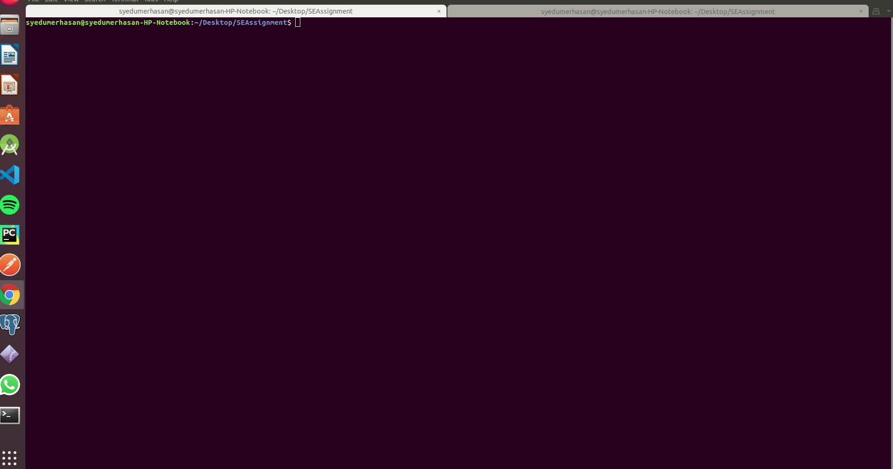

# Multithreaded Java table priniting with CORBA

 In this project, I have created a multithreaded java application that can print tables and and its iteration multiple time.

[](https://www.codeforgeeks.com/)

[](https://syedumerhasan.com)




  

## Folder structure

````
-> master
    ->  HelloApp
        ->  Hello.class	
        ->  Hello.java	
        ->  HelloHelper.class	
        ->  HelloHelper.java	
        ->  HelloHolder.class	
        ->  HelloHolder.java	
        ->  HelloOperations.class	
        ->  HelloOperations.java	
        ->  HelloPOA.class	
        ->  HelloPOA.java	
        ->  _HelloStub.class	
        ->  _HelloStub.java
    ->  orb.db	
    ->  Hello.idl	
    ->  HelloClient.class	
    ->  HelloClient.java	
    ->  HelloImpl.class	
    ->  HelloServer.class	
    ->  HelloServer.java	
    ->  MyThread.class	
    ->  README.md	
    ->  corba.gif
	
````

## How To run	
### For Windows 
1. `idlj -fall  Hello.idl`
2. `javac *.java HelloApp/*.java`
3. `start orbd -ORBInitialPort 1050`
4. `start java HelloServer -ORBInitialPort 1050 -ORBInitialHost localhost`
5. `java HelloClient -ORBInitialPort 1050 -ORBInitialHost localhost`

### For Ubuntu
1. `idlj -fall  Hello.idl`
2. `javac *.java HelloApp/*.java`
3. `  orbd -ORBInitialPort 1050&`
4. `java HelloServer -ORBInitialPort 1050 -ORBInitialHost localhost&`
6. `java HelloClient -ORBInitialPort 1050 -ORBInitialHost localhost`


